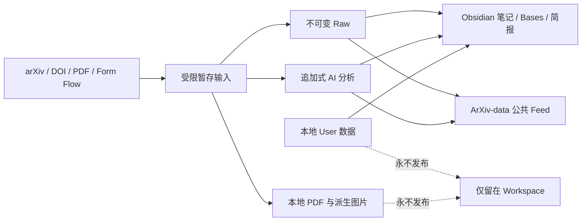

# PaperFlow 用户与维护者指南

本文是 PaperFlow 的中文总入口，适用于第一次使用 PaperFlow 的读者、负责
维护个人 Workspace 的用户，以及维护程序和公共数据源的开发者。文档事实截至
2026-07-19；具体能力验收见
[验证矩阵](verification-matrix.md)。

## 先理解三个边界

| 对象 | 位置 | 主要内容 | 许可证 |
| --- | --- | --- | --- |
| PaperFlow 程序 | [`threeyang3/PaperRead`](https://github.com/threeyang3/PaperRead) | Python 包、Schema、迁移、模板、Obsidian 集成、测试和 Release | MIT |
| 公共论文数据源 | [`threeyang3/ArXiv-data`](https://github.com/threeyang3/ArXiv-data) | 可订阅的 Raw 元数据、AI 分析、清单和校验和 | CC BY 4.0 |
| 用户 Workspace | 本地 Obsidian Vault | PDF、笔记、阅读状态、个人标签、日志、缓存和备份 | 不公开 |

PaperRead 和 ArXiv-data 都使用 `main` 作为默认分支，但发布节奏彼此独立。
更新论文数据不会触发软件版本发布，修改程序也不会改写订阅数据历史。



# 用户指南

## 1. 环境要求

- Python 3.11 或更高版本；
- Obsidian Desktop；当前 Windows 验收版本为 1.12.7；
- 官方 Form Flow 0.0.8 或更高版本，用于手工录入论文；
- PaperFlow Automation 插件，用于控制中心和 Obsidian 内部定时任务；
- Codex CLI 或 Claude Code 仅在需要真实 AI 分析时才是必需项。

Windows 是当前完整验证的平台。Python 包的数据模型可以在 macOS 和 Linux
使用，但这两个平台尚无完整的便携包验收，详见
[验证矩阵的可迁移性评估](verification-matrix.md#portability-assessment)。

## 2. 安装与初始化

从 PaperRead 源码安装：

```powershell
git clone https://github.com/threeyang3/PaperRead.git
Set-Location PaperRead
pipx install .
paperflow init --vault "D:\Notes\Research"
paperflow doctor
```

也可以使用 GitHub Release 中的 wheel 或 Windows x64 便携包。初始化过程中
选择 Form Flow、Bases 和 Obsidian Automation 后，打开该 Vault 并等待
Obsidian 完成 Workspace 加载。

正常使用不需要注册 Windows 计划任务，也不需要把 Vault 加入用户 `PATH`。

## 3. 从控制中心开始

PaperFlow Automation 会在 Workspace 加载后打开控制中心；也可以从左侧
Ribbon、命令面板或插件设置页打开。控制中心的功能是并列入口，不是固定的
线性流程：

- 收集 arXiv ID、DOI、PDF URL 或论文页面；
- 按研究主题发现候选论文；
- 浏览论文库、视觉卡片和每日新增；
- 继续阅读队列或复现队列；
- 分析已经导入的论文；
- 设置 Agent provider、model、reasoning effort、超时和复用策略；
- 处理 Form Flow Inbox 或生成每日简报。

订阅、发布、迁移、升级和诊断位于“高级工具”。这些操作不会成为收集、分析
或阅读的必经后继步骤。

## 4. 添加、分析和查看论文

命令行与控制中心使用同一套后端：

```powershell
paperflow paper add "https://arxiv.org/abs/2410.24164"
paperflow paper analyze "arxiv:2410.24164"
paperflow paper visuals "arxiv:2410.24164"
paperflow validate
```

分析 Agent 只接收暂存的元数据和选取后的论文文本。Codex 固定使用只读
sandbox，Claude 固定禁用工具；两者都不能直接编辑 Vault，也不能执行论文、
LaTeX、仓库或安装脚本。

中文 Obsidian 会尽可能显示中文界面、属性标签和解释结构，但论文标题、摘要、
图注、引用和 PDF 原文不会被机械翻译。

## 5. 订阅 ArXiv-data

```powershell
paperflow source add https://github.com/threeyang3/ArXiv-data.git --name arxiv-data
paperflow source inspect arxiv-data
paperflow source sync arxiv-data --dry-run
paperflow source sync arxiv-data
```

首次同步前应检查来源和信任模式。可选模式为：

- `metadata-only`：只接收来源元数据；
- `metadata-and-ai`：同时接收带完整 provenance 的 AI 分析；
- `disabled`：保留配置但不联系来源。

同步会验证版本、路径、Schema 和每个 SHA256。远程仓库仅按数据读取，里面的
脚本、插件或命令不会执行；本地 `user_*`、用户标签和用户笔记不会被覆盖。

## 6. Obsidian 内部定时任务

自动化只在 Obsidian Desktop 打开时运行：

- 每日工作流默认在 Asia/Shanghai `08:00` 检查；
- Inbox 默认每 5 分钟检查，并监听 Form Flow 文件事件；
- 启用的数据源按各自间隔同步；
- 只有用户明确授权后，数据源主机才会自动发布；
- 更新检查可以自动发现并校验新版本，但应用升级仍需确认。

关闭 Obsidian 会停止这些任务。错过的每日任务可在下次启动后补跑。运行
`paperflow doctor` 可以看到当前调度配置和最近一次结果。

## 7. 图片与本地数据

PaperFlow 从本地 PDF 提取有可靠图注支撑的图片，优先架构、方法、结果和
任务/硬件图。图片、清单和 Markdown 都属于可重建 Derived 数据，不进入
ArXiv-data。

以下内容始终只留在本机：

- PDF 和提取文本；
- `user_*` 阅读数据、个人标签和用户笔记区；
- `.paperflow/workspace.local.yaml`；
- 日志、SQLite、缓存、备份和本地路径。

## 8. 安全升级

控制中心可以发现 GitHub 的稳定 Release，并在 SHA256 匹配后暂存 wheel。
应用更新仍需用户单独确认。更新事务会：

1. 重新校验 wheel；
2. 备份 Workspace；
3. 隔离导入新运行时；
4. 保留旧运行时作为回滚材料；
5. 更新程序、Workspace 和版本化 Obsidian 资源；
6. 验证迁移结果。

更新完成后正常重启 Obsidian。同步论文数据、重新分析论文和重渲染 Markdown
是三个独立操作，不会因为升级程序而自动混在一起执行。

## 9. 用户自检与故障排查

```powershell
paperflow doctor
paperflow audit
paperflow workspace validate
paperflow paths validate
paperflow migrate verify
paperflow publish validate
paperflow publish scan
```

常见问题：

- 控制中心未出现：确认插件已启用，重新加载插件或正常重启 Obsidian；
- 中文属性仍为英文：确认 Obsidian 自身语言是中文，而不只是 Windows 是中文；
- 自动任务未运行：确认 Obsidian 保持打开，并查看 Doctor 的最近运行时间；
- 图片缺失：确认存在本地 PDF，再运行 `paperflow paper visuals <paper_uid>`；
- Feed 同步失败：先运行 `source inspect`，不要绕过校验和或强行写入；
- 数据版本比程序新：升级 PaperFlow，不要手工降低 Schema 版本。

更多处理方法见 [故障排查](troubleshooting.md)。

# 维护者指南

## 1. 开发环境

```powershell
git clone https://github.com/threeyang3/PaperRead.git
Set-Location PaperRead
py -3.12 -m venv .venv
.\.venv\Scripts\python.exe -m pip install -e ".[dev]"
$env:PYTHONPATH = (Resolve-Path "src")
.\.venv\Scripts\python.exe -m pytest -q
node --test tests/integration/test_scheduler_core.js tests/integration/test_automation_plugin_lifecycle.js
```

开发时以 Vault 外独立 `PaperRead/src/paperflow` 为唯一程序源码。Vault 的
`.paperflow/.venv` 安装 wheel；插件不注入或回退到任何 Vault 源码目录。

## 2. 不可破坏的契约

| 变更 | 同时必须更新 |
| --- | --- |
| 新增或修改论文 YAML 字段 | Schema、模板、正式迁移、测试和文档 |
| 修改 Prompt | Prompt 版本和相应 provenance 测试 |
| 修改数据布局 | PaperFlow migration，禁止批量手改生成论文 |
| 修改模板或 Obsidian 资源 | bundle/integration 版本、冲突安全安装和测试 |
| 移动路径 | wikilink、附件路径、Base 和路径迁移验证 |
| 修改 Feed 格式 | Feed Schema、最小 reader 版本、发布/订阅兼容测试 |
| 修改发布内容 | 隐私扫描、Archive 测试和许可证说明 |

任何渲染都必须先合并 User sidecar、现有 `user_*` 和
`USER_NOTES_START/END`。任何 AI Adapter 都只能读取暂存输入，不能获得 Vault
写权限或任意工具权限。

## 3. 代码和 Workspace 的关系

PaperRead 源码仓库与验收 Vault 物理分离，维护时要严格区分：

- 应提交：`src/`、`tests/`、`schemas/`、`templates/`、`integrations/`、
  `migrations/`、`scripts/`、`docs/`、`.github/`；
- 不应提交：`.paperflow/`、`10 Papers/`、`80 Attachments/`、日志、数据库、
  备份、个人配置和用户笔记；
- 修改 `.obsidian` 前必须先备份；
- 不要用 Git 清理或覆盖用户未跟踪文件。

机器相关设置放入忽略的 `.paperflow/workspace.local.yaml`。公开的示例配置
必须保持脱敏和可迁移。

## 4. 完整验证

每次代码修改至少执行：

```powershell
$env:PYTHONPATH = (Resolve-Path "src")
.\.paperflow\.venv\Scripts\python.exe -m pytest -q
node --test tests/integration/test_scheduler_core.js tests/integration/test_automation_plugin_lifecycle.js
.\.paperflow\.venv\Scripts\paperflow.exe doctor --no-network
.\.paperflow\.venv\Scripts\paperflow.exe audit
.\.paperflow\.venv\Scripts\paperflow.exe migrate verify
```

修改 Base 或插件后，还要使用 Obsidian CLI 查询全部 Base、重载插件并检查
`dev:errors`。修改 Feed 后必须从一个全新 clone 验证，Windows 还需覆盖
`core.autocrlf=true`。

## 5. 构建 PaperRead

```powershell
.\.paperflow\.venv\Scripts\python.exe scripts/build_release.py
Get-Content dist\SHA256SUMS
```

构建产物包括 wheel、sdist、`PaperFlow-portable`、`PaperFlow-Template-Vault`、
Schema/模板 ZIP、迁移说明和 SHA256 清单。构建后重跑 packaging 测试，并在干净环境安装 wheel
执行 `paperflow --help`。

PaperRead 当前有五类 GitHub Actions：跨平台 CI、Build、Feed validation、
Migration tests 和 tag-driven Release。只有稳定的
`vMAJOR.MINOR.PATCH` tag 才应创建公开软件 Release。

## 6. 维护 ArXiv-data

数据发布必须来自 PaperFlow publisher，不能手工编辑已纳入校验和的生成文件：

```powershell
paperflow publish plan
paperflow publish build
paperflow publish validate
paperflow publish scan
```

确认本地 Feed Git `origin` 精确指向
`https://github.com/threeyang3/ArXiv-data.git` 后，才可以提交和推送。自动发布
同样会重新 build、validate、scan；无数据变化时不产生空提交。

ArXiv-data 自己的 GitHub Actions 会从 PaperRead `main` 安装验证器，校验
Schema、SHA256 和公开数据边界，并生成 `ArXiv-data-feed.zip` Artifact。
该 ZIP 是便携快照，Git 仓库 URL 仍是订阅的规范来源。

## 7. 发布前清单

- [ ] 应用、Workspace、Schema、模板和 integration 版本关系正确；
- [ ] 完整 pytest 与两个 Node 集成测试通过；
- [ ] Doctor、audit、migration、path、Base 和 Obsidian runtime 通过；
- [ ] wheel、sdist、便携包和全部 SHA256 通过；
- [ ] PaperRead 五类 Actions 通过；
- [ ] ArXiv-data validate/package Action 通过；
- [ ] Feed 不含 PDF、User Data、路径、日志、数据库、缓存或凭据；
- [ ] README、CHANGELOG、本指南、升级和发布文档与代码一致；
- [ ] 只暂存预期文件，未纳入当前用户的 Vault 数据。

## 当前已验证基线

2026-07-19 的真实验收基线：

- PaperFlow 1.4.0；
- 仓库权威 `tests/` 目录的 93 项 pytest 和 2 项 Node 集成测试通过；运行环境不再保存第二份测试源码；
- 29 篇论文、29 份完整 AI 分析、166 张可追溯图片；
- π0、FAST、π0.5 使用 Claude Code 2.1.206 + Xiaomi `mimo-v2.5`；
- ArXiv-data 含 29 Raw + 29 AI，远程往返产生 58 个只读订阅缓存记录；
- 1.4.0 本地发布物、迁移、健康、audit 和包装审计通过；
- Obsidian 实时 DOM/截图/控制台复验因 Codex 隔离账号无法显示窗口，仍需用户
  交互式打开后完成；ChatGPT Web 已验证安全接管路径，成功上传仍待兼容模型菜单。

这些数量用于验收，不是写死在程序逻辑中的产品限制。
